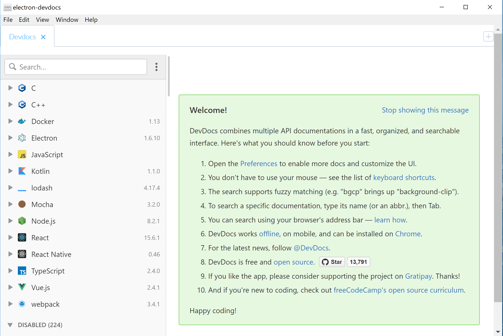

# electron-devdocs

[](https://circleci.com/gh/gengjiawen/electron-devdocs)
[](https://ci.appveyor.com/project/gengjiawen/electron-devdocs/branch/master)
[](https://gitpod.io/#https://github.com/gengjiawen/electron-devdocs)

> An electron-vue project for devdocs

## What does it look like




## Feature
* Multi tab
* Auto-Updater
* Inner google search

## Build Setup
```bash
yarn
yarn run electron:serve
```


## License
[MIT](http://opensource.org/licenses/MIT)

Copyright (c) 2017-present, Jiawen (Daniel) Geng
